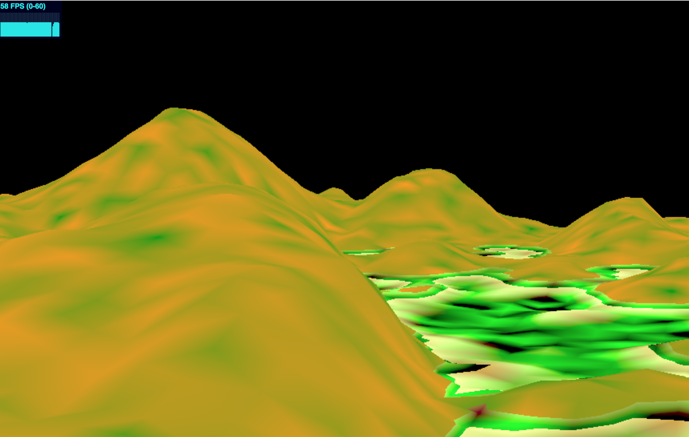
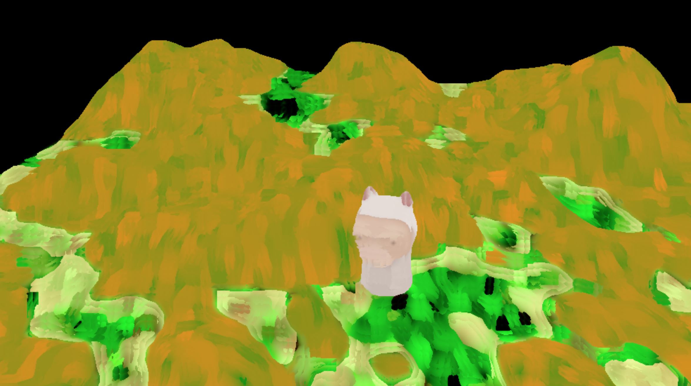
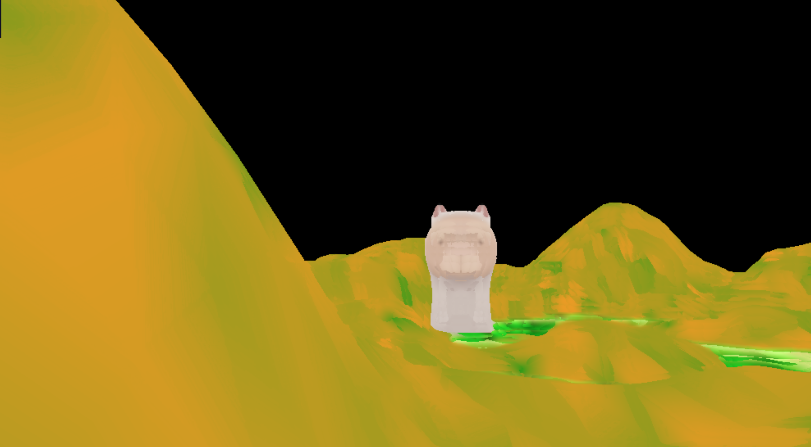
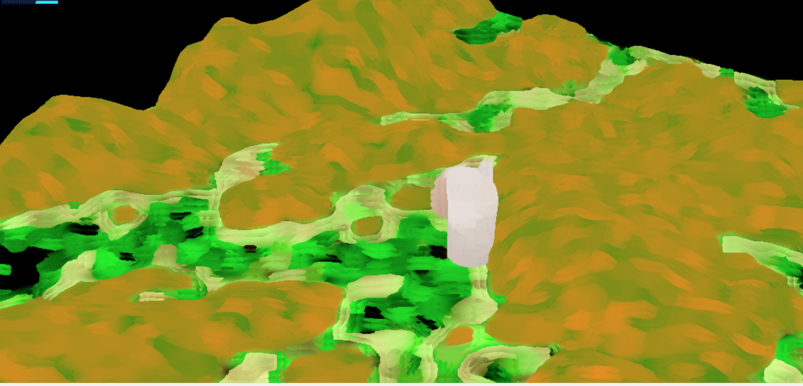
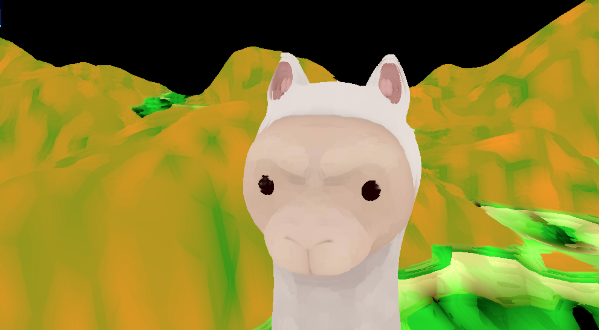

# Final Project
**Jamie Schwartz and Kathryn Miller** 

## Milestone 1
## Demo: https://jamie2719.github.io/566-final-project/
This demo link doesn't actually work yet because of the same issue people were having in the deferred renderer homework where the textures couldn't be loaded (we used the base code from that homework)- images are below

**Jamie**

This week I implemented 3D Perlin noise to procedurally generate the terrain of our scene. I used summed Perlin noise to achieve a smoother effect. Once I calculated the summed Perlin noise for each point, I used it as an offset to add to the y component of that point. I also increased the amplitude of the peaks of the terrain to make it seem more hilly. All of this was done in the vertex shader terrain-vert.glsl. In the fragment shader (terrain-frag.glsl), I colored the terrain based on its height and then combined that color with a light intensity calculated using Lambert shading. I tried to use a color pallette that was similar to many of Van Gogh's landscape paintings. I also added different noise to each color so that there would be more variation in the appearance of the terrain. I had trouble getting the border between each "level" of the terrain to be more blurred, and this is something I will continue to work on next week in order to make the transitions in the terrain look more natural. I also might try to change the coloring of the terrain to use textures instead of just colors if we have time. 

Next week, my main focus will be on creating L-System trees and integrating them into the rest of the project so that they look like they belong in the terrain that I've created this week. I will create procedural textures for some components of the scene (maybe the trees or terrain) if I have time using Substance Designer. I will also continue to tweak the parameters of the terrain as the rest of the project comes together, if needed.

Also, after we merged our two branches, the terrain started disappearing sometimes when we zoomed out. We are not sure why this is happening, and it did not happen at all in the earlier versions of our separate branches before the merge. We will also figure this bug out next week.

**Kathryn**

This week I tried my very hardest to do shadow mapping and if not for the grace of Jin would I have anything. He showed me I needed to use an orthogonal matrix instead of perspective projection matrix and also showed me not to use the depth attachment for a shadow map. Most of my issues happened in OpenGLRenderer from lack of my lack of understanding of opengl. Jamie and I had trouble merging though and need to redesign our pipelines such that the shadows show up on the terrain she created. I also did a post processing paint effect (which looks better on the terrain than the alpaca). Next week I'll first try to smooth the shadows and then work on other post processing effects as well as textures, and backdrops for the "painting".

**Images**

